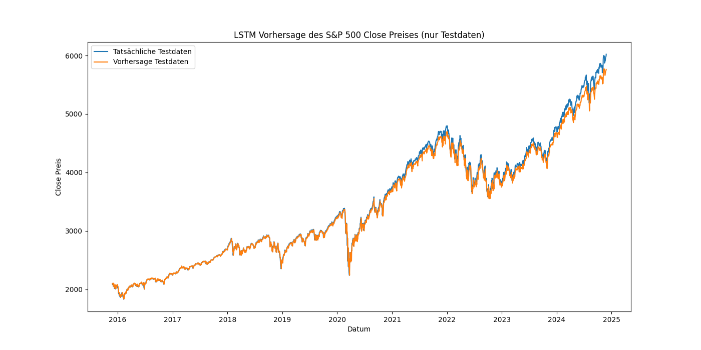
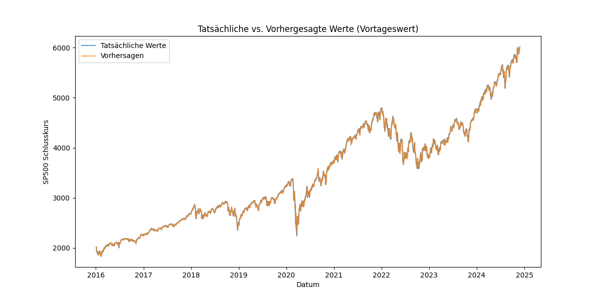

# 📊 SP500 Schlusskurs-Vorhersage mit LSTM und RNN

## Kurzbeschreibung
Dieses Experiment untersucht die Vorhersage des SP500-Schlusskurses mit zwei neuronalen Netzwerkarchitekturen: LSTM und RNN. 
Es werden historische Daten verwendet, um Modelle zu trainieren und deren Vorhersageleistung zu bewerten.

---

## 📅 Datenerfassung
Die Daten stammen aus einer historischen SP500-Datenbank. Sie enthalten tägliche Informationen wie Öffnungs-, Hoch-, Tief- und Schlusskurse sowie Volumina.

---

## 📊 Merkmale
- **Eingabedaten:** Öffnungskurse, Hochs, Tiefs, Schlusskurse, Volumen.
- **Zieldaten:** Schlusskurse.
- Die Daten wurden mit einem `MinMaxScaler` auf den Bereich [0, 1] skaliert.

---

## 🛠️ Modellarchitektur

### LSTM (Long Short-Term Memory)
- **Input Layer:** Ein einzelnes Merkmal.
- **Hidden Layer:** 1 LSTM-Schicht mit 50 Einheiten.
- **Output Layer:** Eine vollständig verbundene Schicht.

### RNN (Recurrent Neural Network)
- **Input Layer:** Ein einzelnes Merkmal.
- **Hidden Layer:** 1 vollständig verbundene Schicht.
- **Output Layer:** Eine vollständig verbundene Schicht.

---

## 📈 Leistungskriterien
- **Trainings- und Validierungsverlust (MSE):** Verlust wird während des Trainings für beide Modelle überwacht.
- **MAPE (Mean Absolute Percentage Error):** Durchschnittliche prozentuale Abweichung zwischen den tatsächlichen und vorhergesagten Schlusskursen.

---

## 🚀 Ausgangspunkt
1. **LSTM-Ergebnisse:** 
    - Bester MAPE: 1.18%
    - Ergebnisse gespeichert in: `lstm_sp500_results_5.csv`
2. **RNN-Ergebnisse:**
    - Bester MAPE: 1.98%
    - Ergebnisse gespeichert in: `rnn_sp500_train_results_5.csv`

---

## 📊 Ergebnisse
### Vergleich der Modelle
- **LSTM:** Konsistente Ergebnisse mit MAPE-Werten zwischen 1.18% und 1.54%.
- **RNN:** Schwankendere Ergebnisse mit MAPE-Werten zwischen 1.98% und 2.78%.
- **Empfehlung:** Das LSTM zeigt eine bessere Anpassungsfähigkeit an sequentielle Daten und ist daher für Vorhersagen besser geeignet.

### **Visualisierung der Ergebnisse**

#### LSTM

#### RNN

