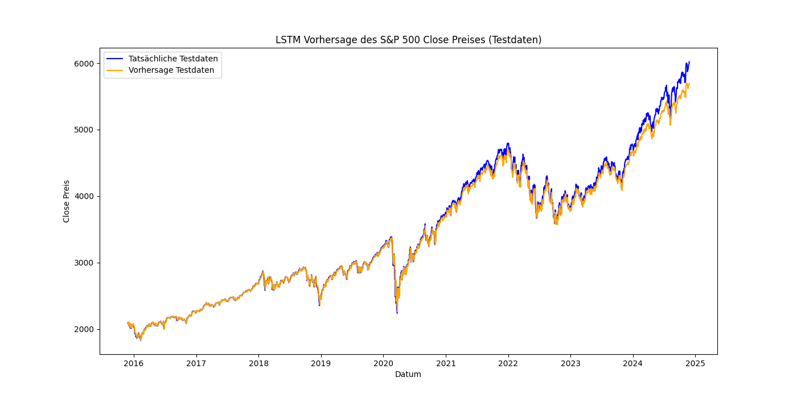

📊 SP500 Open-Preis-Vorhersage mit LSTM

📝 Kurzbeschreibung

Dieses Teilprojekt konzentriert sich auf die Vorhersage des Open-Preises des S&P 500 Index mithilfe eines Long Short-Term 
Memory (LSTM)-Modells. Ziel ist es, mithilfe historischer Finanzdaten zukünftige Open-Preise präzise vorherzusagen. 
Das Modell basiert auf einem bestehenden LSTM-Ansatz, der im Rahmen von Experiment 1 entwickelt wurde, 
und wurde für diese Analyse weiter optimiert.

---

## 📅 **Datenerfassung**
- **Datenquelle:** Historische SP500-Daten (CSV-Datei)
- **Enthaltene Informationen:**
  - Datum
  - Eröffnungskurs (**Open**)
  - Höchstkurs (**High**)
  - Tiefstkurs (**Low**)
  - Schlusskurs (**Close**)
  - Handelsvolumen (**Volume**)
- **Zeitraum der Daten:**
  - **Trainingsdaten:** 80% der Daten (ältere Jahre)
  - **Testdaten:** 20% der Daten (neuere Jahre)
- **Vorverarbeitung:**
  - Chronologische Sortierung
  - Skalierung mit **MinMaxScaler** auf den Bereich [0, 1]

---

## 📊 **Merkmale**
- **Eingabe-Features:**
  - Close: Schlusskurs
- **Zielvariable:**
  - Close-Preis für den nächsten Tag

---

## 🛠️ **Modellarchitektur**
- **Modelltyp:** LSTM
- **Parameter:**
  - Eingabefunktionen: 1 (Close-Preis)
  - Hidden-Size: 100
  - Anzahl der Schichten: 2
  - Dropout: Nicht verwendet
  - Verlustfunktion: **Mean Squared Error Loss (MSELoss)**
  - Optimierer: **Adam**
  - Lernrate: 0.001
  - Epochen: 100
  - Batch-Größe: 64
  - Gradient Clipping: 1.0 (zur Stabilisierung des Trainings)
- **Zeithorizont:** 60 Tage historischer Daten als Eingabe zur Vorhersage des nächsten Open-Preises

---

## 📈 **Leistungskriterien**
- **Trainingsverlust:** Verlustfunktion über die Epochen hinweg überwacht
- **Testverlust (MSE):** Bewertet auf unbekannten Daten
- **Visualisierung:** Tatsächliche vs. vorhergesagte Open-Preise
- **Leistungsmetriken:**
  - **Root Mean Squared Error (RMSE):** Abhängig vom Experiment (siehe Ergebnisse)
  - **Mean Absolute Error (MAE):** Abhängig vom Experiment (siehe Ergebnisse)
  - **Mean Absolute Percentage Error (MAPE):** Variiert je nach Durchlauf (0.81–0.90 % für Training, 1.26–1.53 % für Test)

---

## 🚀 **Ergebnisse**

### **Trainings- und Validierungsverlauf**
Hier sind die Ergebnisse von fünf Modell-Durchläufen zusammengefasst:

| Experiment | Training Loss (Ende) | Validation Loss (Ende) | MAPE Training | MAPE Test  |
|------------|-----------------------|------------------------|---------------|------------|
| 1          | 0.000029             | 0.001563              | 0.84 %        | 1.26 %     |
| 2          | 0.000029             | 0.001563              | 0.84 %        | 1.26 %     |
| 3          | 0.000032             | 0.002374              | 0.90 %        | 1.53 %     |
| 4          | 0.000029             | 0.001563              | 0.84 %        | 1.26 %     |
| 5          | 0.000029             | 0.002103              | 0.81 %        | 1.44 %     |

### **Visualisierung der Ergebnisse**

Die Visualisierung zeigt eine enge Übereinstimmung zwischen tatsächlichen und vorhergesagten Open-Preisen, insbesondere für die Testdaten.

### **CSV-Dateien**
Die Ergebnisse der Vorhersagen, tatsächlichen Werte und prozentualen Abweichungen wurden in folgenden Dateien gespeichert:
- Experiment 1: `/lstm_sp500/lstm_sp500_results_1.csv`
- Experiment 2: `/lstm_sp500/lstm_sp500_results_2.csv`
- Experiment 3: `/lstm_sp500/lstm_sp500_results_3.csv`
- Experiment 4: `/lstm_sp500/lstm_sp500_results_2.csv`
- Experiment 5: `/lstm_sp500/lstm_sp500_results_5.csv`

---

## 🔧 **Verbesserungspotenzial**
- Integration zusätzlicher Merkmale wie makroökonomischer Indikatoren oder Sektordaten des S&P 500
