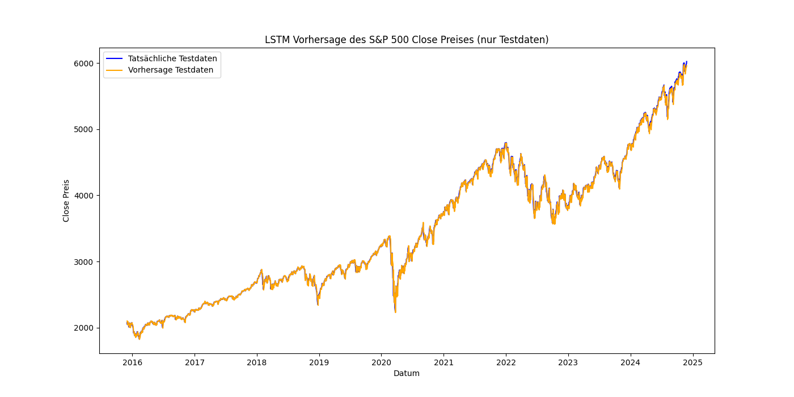
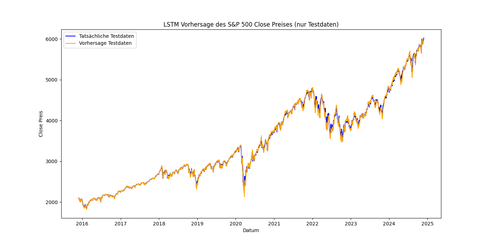
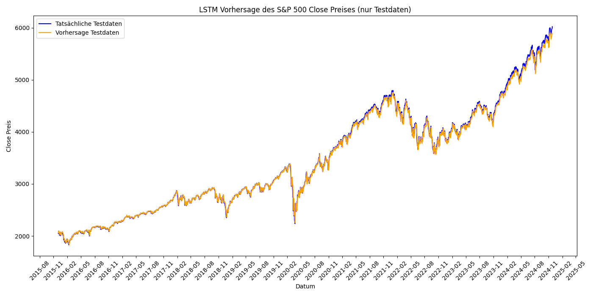

# 📊 SP500 Schlusskurs-Vorhersage mit LSTM

## Kurzbeschreibung
In diesem Experiment wurde die Schlusskurs-Vorhersage des S&P 500 Index unter Verwendung von LSTM-Modellen untersucht. Es wurden drei verschiedene technische Indikatoren als Features verwendet: RSI (Relative Strength Index), MACD (Moving Average Convergence Divergence) und Bollinger Bands. Ziel war es, die Vorhersagegenauigkeit der Modelle zu bewerten und die Leistung der verschiedenen Ansätze zu vergleichen.

---

## 📅 Datenerfassung
- Historische Daten des S&P 500 Index wurden aus einer CSV-Datei geladen.
- Die Dateien enthielten jeweils die Schlusskurse und die entsprechenden Indikatoren (RSI, MACD, Bollinger Bands).
- Die Daten wurden nach Datum sortiert und skaliert, um sie für das Training und die Modellierung vorzubereiten.

---

## 📊 Merkmale
### Verwendete technische Indikatoren:
- **RSI (Relative Strength Index):** Ein Momentum-Indikator, der die Geschwindigkeit und Änderung von Preisbewegungen misst.
- **MACD (Moving Average Convergence Divergence):** Ein Trendfolge-Indikator, der aus zwei gleitenden Durchschnitten besteht.
- **Bollinger Bands:** Ein Volatilittätsindikator, der auf Basis eines einfachen gleitenden Durchschnitts erstellt wird.

---

## 🛠️ Modellarchitektur
- **Modelltyp:** Long Short-Term Memory (LSTM) Netzwerk
- **Eingabe-Features:**
  - RSI: 2 Features (Close, RSI)
  - MACD: 2 Features (Close, MACD)
  - Bollinger Bands: 4 Features (Close, BB_Middle, BB_Upper, BB_Lower)
- **Hyperparameter:**
  - Anzahl der Epochen: Variierte zwischen 40 (RSI), 60 (MACD) und 150 (Bollinger Bands).
  - Batch-Größe: 128
  - Lernrate: 0.001
  - Verlustfunktion: Mean Squared Error (MSE)

---

## 📈 Leistungskriterien
- **Mean Absolute Percentage Error (MAPE):** Durchschnittlicher absoluter prozentualer Fehler zwischen den Vorhersagen und den tatsächlichen Schlusskursen.
- Validierungsverlust (MSE) über die Epochen.

---

## 🚀 Ausgangspunkt
- Die Datensätze wurden in Trainings- und Testsets (80:20) aufgeteilt.
- Die Modelle wurden mit CPU trainiert.

---

## 📊 Ergebnisse
### Trainingsergebnisse:
#### RSI:
- Durchschnittliche MAPE:
  - Versuch 1: 0.77%
  - Versuch 2: 0.80%
  - Versuch 3: 0.76%
  - Versuch 4: 0.95%
  - Versuch 5: 0.92%

#### MACD:
- Durchschnittliche MAPE:
  - Versuch 1: 0.96%
  - Versuch 2: 1.03%
  - Versuch 3: 0.95%
  - Versuch 4: 0.95%
  - Versuch 5: 0.94%

#### Bollinger Bands:
- Durchschnittliche MAPE:
  - Versuch 1: 0.87%
  - Versuch 2: 0.84%
  - Versuch 3: 0.76%
  - Versuch 4: 1.07%
  - Versuch 5: 0.94%

### Schlussfolgerungen:
- **RSI** und **Bollinger Bands** erzielten die niedrigste MAPE (~0.76%) in den besten Durchläufen.
- **MACD** zeigte konsistente Ergebnisse, lag jedoch leicht über der MAPE von RSI und Bollinger Bands.
- Die Variationen zwischen den Versuchen zeigen die Empfindlichkeit der Modelle gegenüber unterschiedlichen Initialisierungen und Trainingsbedingungen.

---

## 📊 Ergebnisse
Die Ergebnisse jeder Versuchskombination wurden in separaten CSV-Dateien gespeichert, die die tatsächlichen Werte, die vorhergesagten Werte und die prozentualen Abweichungen enthalten.

**Speicherorte der CSV-Dateien:**
- RSI: `lstm_sp500/rsi/lstm_sp500_results_<n>_with_RSI.csv`
- MACD: `lstm_sp500/macd/lstm_sp500_results_<n>_with_MACD.csv`
- Bollinger Bands: `lstm_sp500/bb/lstm_sp500_results_with_BB_<n>.csv`

## 📊 Visualisierung der Ergebnisse

### RSI:

### MACD:

### Bollinger Bands:

---

## 🔧 Code
Der gesamte Code für die Experimente ist in den folgenden Skripten implementiert:
- `lstm_sp500_with_rsi.py`
- `lstm_sp500_with_macd.py`
- `lstm_sp500_with_bb.py`

Der Code beinhaltet Schritte zur Datenvorbereitung, Modelldefinition, Training, Validierung und Visualisierung der Ergebnisse.

---